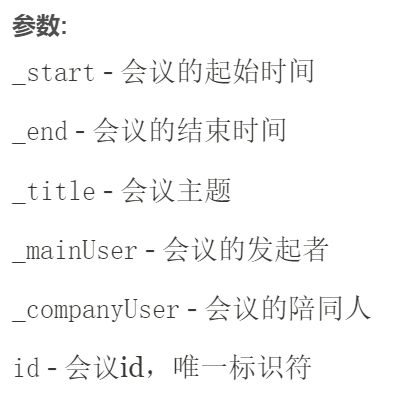
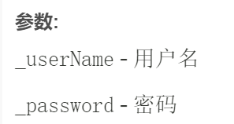

<center><b><font size = "7">编译原理预备实验


<center><b><font size = "5">议程管理系统 Agenda


<center><b><font size = "5">设计文档


---


### 1 开发环境与开发工具

#### 1.1 操作系统

Windows 11

#### 1.2 编程语言

java语言，JDK版本1.7.2

#### 1.3 开发工具

Visual Studio Code + cmd


### 2 需求分析

#### 2.1 功能需求

本实验要求完成的议程管理系统至少应实现如下功能。 

##### 2.1.1 用户注册

注册新用户时，应为该用户设置一个唯一的用户名以及一个密码。

 如果注册时提供的用户名已由其他用户使用，应反馈一个适当的出错信息；成功注册后，亦应反馈一个 成功注册的信息。

##### 2.1.2 添加会议

已注册的用户可以添加一个新会议到其议程安排中。规定会议仅允许在两个已注册的用户间举行，不可创建无另一已注册用户的会议。 

添加会议时提供的信息应包括：会议的起始时间（start time）和终止时间（end time）、描述本次会议的标签（label）、以及预约的另一用户名字（scheduled user）。成功添加会议后，它应既出现在发起该会议的用户的议程中，也应出现在该会议所预约的另一用户的议程中。

 注意，用户不允许分身参加多个会议，即如果用户自己或被预约的用户已有一个会议安排与新会议在时 间上相互重叠（overlap），该新会议将无法成功添加到议程管理系统中。

用户在添加会议后，应获得适当的反馈信息，以得知是成功地添加了新会议，还是在添加过程出现了某 些错误。

##### 2.1.3 查询会议

已注册的用户可以查询自己的议程中某一时间段（time interval）的所有会议安排。

查询会议时提供的参数应包括所关注时间段的起始时间和终止时间；查询结果返回该用户议程中在指定时间范围内找到的所有会议安排的列表，在列表中给出每一会议的起始时间、终止时间、标签、以及被预约的另一用户的名字。 

注意，查询会议的结果既应包括用户作为发起人的那些会议，也应包括用户作为被预约人的那些会议。

##### 2.1.4 删除会议

已注册的用户可以删除自己登记的某一会议安排。

删除会议时，提供的参数除执行删除功能的用户的名字及其密码外，还包括一个能惟一地标识待删除的会议的参数。

##### 2.1.5 清除会议

已注册的用户可以清除自己创建的所有会议安排。

#### 2.2 接口约定

系统启动后，显示输入提示符“$”（称之为 prompt，类似 MS-DOS 的提示符“>”），然后与终端用户以命令行方式进行交互。设所有命令的名字是大小写无关的，但命令的参数却是大小写敏感的。约定系统支持的交互命令格式如下：

<u>$ register [userName] [password]</u>
  该命令用于注册一个新用户。其中，参数 userName是用户提供的注册名字，password 是用户自己选择的密码。

<u>$ add [userName] [password] [other] [start] [end] [title]</u>
  该命令用于添加一个新的会议安排。其中，参数 userName 是一个已注册的用户名字，password 是该用户的密码，other 是新添加会
议所预约的另一已注册用户的名字，start 是会议的起始时间，end 是会议的终止时间，title 是新添加会议的标签。

日期格式为：yyyy-MM-dd,HH:mm:ss。

<u>$ query [userName] [password] [start] [end]</u>
  该命令用于查询某一用户在某一时间段内的会议安排。其中，参数 userName 是一个已注册的用户名字，password 是该用户的密码，start 和 end 分别是查询时间段的起始时间和终止时间，该时间段内查获的会议安排将被返回。

<u>$ delete [userName] [password] [meetingId]</u>
该命令用于删除某一用户的指定会议安排。其中，参数 userName 是一个已注册的用户名字，password 是该用户的密码，meetingId 指
定将被从议程中删除的会议的标识。

<u>$ clear [userName] [password]</u>
  该命令用于清除某一用户的所有会议安排。其中，参数 userName 是一个已注册的用户名字，password 是该用户的密码。

<u>$ batch [fileName]</u>
该命令用于批处理存储在文本文件 fileName 中的 register、add、query、delete、clear 等命令，其中每一条命令（包括其参数）单独占一行。  该命令相当于 MD-DOS 中的脚本文件（即批命令文件.bat 或.cmd）。借助该命令，你可以方便地运行多个不同的测试用例 。

<u>$ quit</u>

退出程序。


<div STYLE="page-break-after: always;"></div>

### 3 系统设计

#### 3.1 UML


**\*Exceptions的类没有放入UML中**

**\*Meeting和User中的对成员函数调用的get和set函数没有放入类图当中**


#### 3.2 软件架构

##### 3.2.1 表达层


读取用户输入的数据（命令），将命令传递给解析器解析后，解析器传递命令解析后的结果给表达层，表达层再将结果提供给命令执行器执行命令。执行器将执行结果返回给表达层，表达层将执行结果转换为可视化的结果打印给用户。

##### 3.2.2 业务逻辑层

该部分包含了两个部分：命令解析和执行，用户和会议系统。


**命令解析**

根据输入的命令，解析该命令参数属于哪一个类型的命令，并得到相应命令类的实例。

**命令执行**

用于执行各种命令，包括执行命令前的检查和执行命令。如果检查部分发生错误，将会抛出一个相应的异常。否则会成功执行该命令，并返回一个执行结果。

**用户系统**

包括单个用户信息的存储，以及一个用户表，存储所有用户，以及对用户的增加、删除、修改、查找。

**会议系统**

包括单个会议信息的存储，以及一个会议表，存储所有会议，以及对用户的增加、删除、修改、查找。


#### 3.3 设计模式

##### 工厂方法

在解析和命令模块中，定义了一个命令基类，所有的特定命令继承了该命令基类。

给定输入命令后，解析器解析该命令。实际上，解析器定义了一个创建特定命令类的接口，用于返回特定命令类的实例。


#### 3.4 数据流

##### 3.4.1 用户注册


##### 3.4.2 添加会议


##### 3.4.3 查询会议


##### 3.4.4 删除会议


##### 3.4.5 清除会议


##### 3.4.6 批处理操作

批处理操作调用了上述的五个命令。

事实上，批处理中出现循环操作的错误并没有处理。若在批处理操作中会出现文件批处理循环的情况，可以在操作中增加一个全局静态的列表，用于存储当前正在批处理的文件名。如果即将需要批处理的文件名已出现在列表中，则不进行批处理，并抛出一个错误。


<div STYLE="page-break-after: always;"></div>

### 4 功能设计

#### 4.1 命令与解析模块


##### 4.1.1 解析

解析类用于解析命令，得到命令的类型。

解析的操作为：

​	输入：用户输入的命令串

​	操作：

- 通过正则表达式将多余的空格去除，一步简单的文本清洗。
- 将命令串的第一个字符串提取。
- 逐个匹配该命令属于哪一类的命令。包括无命令和错误指令的处理。

​	输出：命令类的一个实例。

事实上，该类扮演了CommandFactory的角色，作为一个工厂，提供了各种命令作为商品。

##### 4.1.2 命令

命令类是一个抽象类，作为各种命令类的基类，应用了多态的方法处理。

该类有一个成员变量，表示每个类的名称。


以及五个成员函数：


`argsCheck`，`getName`和`loginCheck`是所有命令类共同需要的函数，分别表示检查参数数目、获取类的名称以及登录用户名和密码的检查。

`check`是每个命令特定的检查部分，每一个特定命令重写了该接口，用于每个命令不同的检查处理。

`exec`是每个命令特定的执行部分，每一个特定命令重写了该接口，用于每个命令不同的执行处理。

具体的操作和处理在数据流图和javadoc中表达。

#### 4.2 用户与会议模块


##### 4.2.1 Meeting

`Meeting`类用于记录单个会议的信息。具体的成员变量有：



`Agenda`中用一个数组存储了所有的`Meeting`，并提供了对会议的包括增删改查在内的所有操作。


##### 4.2.2 User

`User`类用于记录单个用户的信息。具体的成员变量有：



`UserTable`中用一个数组存储了所有的`User`，并提供了对用户的包括增删改查在内的所有操作。


#### 4.3 异常处理模块

为了提高可扩展性，对每一种可能发生的错误都设计了一个异常类。目前已知的错误如下：


异常类中设置了一个`CommandError`异常类，该类用于出现次数不多的错误，直接实例化该异常类，并用该错误构造该异常类即可。

#### 4.4 表达模块

用于用户UI界面，读取用户输入信息，并与逻辑层做消息传递，打印命令结果。其功能为：


该层具体的操作为：

​	输入：用户输入的命令

​	操作：

- 将用户输入传递给命令解析器，获得解析结果
- 将解析结果传递给命令执行器，获得执行结果

​	输出：打印执行结果


<div STYLE="page-break-after: always;"></div>

### 5 说明

#### 5.1 可扩展性

##### 5.1.1 添加新命令

添加新的命令，只需要在`agenda.BussinessLogic.Commands`添加一个继承Command基类的命令类，并在解析器中新增一个解析方法即可。

##### 5.1.2 添加新异常处理

异常类中设置了一个`CommandError`异常类，该类用于出现次数不多的错误，直接实例化该异常类，并用该错误构造该异常类即可。

若新异常会频繁产生，则在`agenda.Exceptions`中添加一个继承Exception基类的异常类即可。

##### 5.1.3 新增异常处理操作

若对于某些异常，需要进行某种操作，只需要在相应的异常类中直接进行操作即可。

##### 5.1.4 新增可持久化支持

`User`类和`Meeting`实际上可以直接改造为存储层。


#### 5.2 添加数据说明

添加数据步骤如下：

1. 需要在`./testData/testcase.txt`中添加新增测试用例的名称。
2. 在`./testData/in`中添加测试数据，数据为`txt`格式文件。
3. 在`./testData/ans`中添加数据期望结果，数据为`txt`格式文件。

`RegressionTesting.exe`用于回归测试，**建议普通测试还是应运行`agenda.bat`测试**。


### 6 附件说明

#### 6.1 目录

```
D:.
│  agenda.bat
│  build.bat
│  README.txt
│  RegressionTesting.cpp
│  RegressionTesting.exe
│  design.pdf
|  test.pdf
│
├─bin
│  │  AgendaService.class
│  │
│  └─agenda
│      ├─BussinessLogic
│      │  ├─Commands
│      │  │      Add.class
│      │  │      Batch.class
│      │  │      Clear.class
│      │  │      Command.class
│      │  │      Delete.class
│      │  │      Help.class
│      │  │      NoCommand.class
│      │  │      Parse.class
│      │  │      Query.class
│      │  │      Quit.class
│      │  │      Register.class
│      │  │
│      │  └─System
│      │          Agenda.class
│      │          Meeting.class
│      │          User.class
│      │          UserTable.class
│      │
│      ├─Exceptions
│      │      ArgvNumbersError.class
│      │      CommandNotFound.class
│      │      CommonError.class
│      │      MeetingNotFound.class
│      │      NoPermission.class
│      │      PasswordError.class
│      │      SameUser.class
│      │      UserNameExist.class
│      │      UserNotFound.class
│      │      UserTimeConflict.class
│      │
│      └─Presentations
│              Presentation.class
│
├─doc
│
├─src
│  │  AgendaService.java
│  │
│  └─agenda
│      ├─BussinessLogic
│      │  ├─Commands
│      │  │      Add.java
│      │  │      Batch.java
│      │  │      Clear.java
│      │  │      Command.java
│      │  │      Delete.java
│      │  │      Help.java
│      │  │      NoCommand.java
│      │  │      Parse.java
│      │  │      Query.java
│      │  │      Quit.java
│      │  │      Register.java
│      │  │
│      │  └─System
│      │          Agenda.java
│      │          Meeting.java
│      │          User.java
│      │          UserTable.java
│      │
│      ├─Exceptions
│      │      ArgvNumbersError.java
│      │      CommandNotFound.java
│      │      CommonError.java
│      │      MeetingNotFound.java
│      │      NoPermission.java
│      │      PasswordError.java
│      │      SameUser.java
│      │      UserNameExist.java
│      │      UserNotFound.java
│      │      UserTimeConflict.java
│      │
│      └─Presentations
│              Presentation.java
│
└─testData
    │  testcase.txt
    │
    ├─ans
    │      another.txt
    │      error.txt
    │      null.txt
    │      quit.txt
    │      right.txt
    │
    ├─in
    │      another.txt
    │      error.txt
    │      null.txt
    │      quit.txt
    │      right.txt
    │
    └─out
            another.txt
            error.txt
            null.txt
            quit.txt
            right.txt
```

#### 6.2 说明

- `bin`文件夹中为class字节码
- `doc`文件夹中为javadoc生成的html文件
- `src`文件夹中为系统的源文件
- `testData`文件夹中为系统测试数据
- `agenda.bat`为agenda系统的执行脚本
- `build.bat`为agenda系统的编译脚本
- `RegressionTesting`为用于回归测试的测试脚本
- 还有`README.txt`、设计文档`design.pdf`和测试报告`test.pdf`

