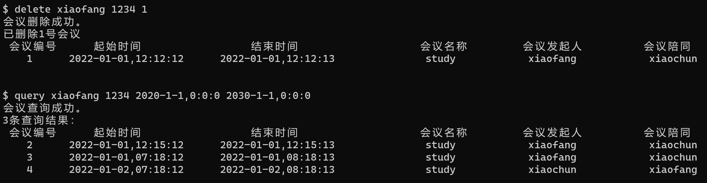
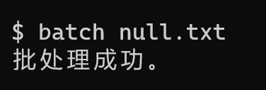

### 测试报告

#### 测试说明

| 测试数据    | 测试用途                                     | 测试数据                                 | 测试结果 |
| ----------- | -------------------------------------------- | ---------------------------------------- | -------- |
| error.txt   | 单元测试，用于逐行测试系统的正确性和稳定性。 | 数据测试了系统的各个模块，包含错误测试。 | 正确     |
| right.txt   | 用于测试批处理。                             | 数据中的测试保证正确性。                 | 正确     |
| another.txt | 用于测试批处理文件中调用批处理。             | 数据中含有批处理。                       | 正确     |
| null.txt    | 用于测试批处理空文件。                       | 数据为空。                               | 正确     |
| quit.txt    | 用于测试批处理quit指令。                     | 数据包含quit。                           | 正确     |

#### 单元测试

**\*以下单元测试失败后，均进行回归测试（RegressionTesting.exe）。**

##### 主界面

期望效果：简洁，美观。

测试结果：正常。

##### 空指令

**测试1**

期望效果：不进行任何操作。

测试结果：正常。

##### help指令

**测试1**

期望效果：打印帮助指令。

测试结果：帮助模块正常。

**测试2**

期望效果：指令首部分为help即可，打印帮助指令。

测试结果：正常。

##### register指令

**测试1**

期望结果：注册成功。

测试结果：注册模块正常。

**测试2**

期望结果：显示用户名存在，不添加用户。

测试结果：用户名检测正常。

**测试3**

期望结果：注册成功。

测试结果：注册模块正常。

**测试4**

期望结果：参数数目过多，应显示参数错误，不添加用户。

测试结果：参数数目检测模块正常。

**测试5**

期望结果：参数数目过少，应显示参数错误，不添加用户。

测试结果：参数数目检测模块正常。

**测试6**

期望结果：忽略大小写，注册用户。

测试结果：大小写转化模块正常。

##### add指令

**测试1**

期望结果：正常添加会议。

测试结果：登录异常。

错误原因：设置了密码错误才能登陆，已修改。

**测试2**

期望结果：显示密码错误，不添加会议。

测试结果：密码检测模块正常。

**测试3**

期望结果：显示时间冲突，不添加会议。

测试结果：时间碰撞检测模块正常。

**测试4**

期望结果：用户重复，不添加会议。

测试结果：成功添加。

错误原因：没有进行用户重复测试，已修改。

**测试5**

期望结果：用户未找到，不添加会议。

测试结果：用户检测模块正常。

**测试6**

期望结果：添加成功。

测试结果：会议编号正常。

**测试7**

期望结果：参数数目不正确，不添加会议。

测试结果：参数数目检测正常。

**测试8**

期望结果：时间起点大于终点，不添加会议。

测试结果：时间比较模块正常。

**测试9**

期望结果：时间忽略前导零不影响，添加成功。

测试结果：时间简写正常。

**测试10**

期望结果：时间格式不正确，不添加。

测试结果：时间解析模块正确。

**测试11**

期望结果：正常添加。

测试结果：正常。

*添加另一个人的会议，后续使用。*

##### query指令

**测试1**

期望结果：4个会议，包括自己发起的和参与的。

测试结果：正常。

**测试2**

期望结果：无参与会议。

测试结果：正常。

**测试3**

期望结果：只查询时间完全包含的结果。

测试结果：正常，但应该查询有重合的还是完全包含的有待商榷。

##### delete指令

**测试1**

期望结果：删除会议1。

测试结果：删除了错误的会议。

错误原因：把除了会议1以外的会议全删了，已修改。

**测试2**

期望结果：不是该用户发起的会议，不删除。

测试结果：会议4被删除了。

错误原因：把自己参与的会议也删了，已修改。

**测试3**

期望结果：无该会议，不删除。

测试结果：会议编号检测模块正常。

##### clear指令

期望结果：清除会议编号2和3的会议。

测试结果：清除模块正常。

##### batch模块

**测试1**

期望结果：成功批处理。

测试结果：正常。

**测试2**

期望结果：能够批处理空文件。

测试结果：正常。

**测试3**

期望结果：能够批处理终结程序。

测试结果：正常。

**测试4**

期望结果：能够处理嵌套批处理，只输出一次批处理成功。

测试结果：正常。
